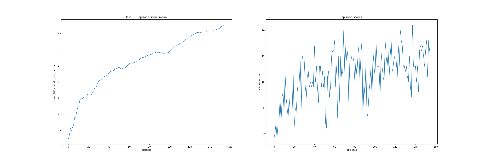

# Project Report

Here is a report of the method used to solve the banana navigation unity environment. The environment has a continuous state space and discrete action space. The state space is a 37 dimension vector of values in [0,1] while the action space is discrete, having just 4 possible values. A reward of +1 is given to the agent for each yellow banana collected and -1 for blue bananas.

To solve the environment, A DQN agent was implemented and trained in the environment till it achieved a score of over 13. The result achieved with the DQN agent is outlined below;

Episodes | average score | evaluation score
--- | --- | ---
155 | 13.02 | 11.0

This result was acheived by using carefully selected set of parameters both for the DQN agent's model and the training process. These choices are subsequently explained;

First, a definition of the parameters

Name | data type | Use
--- | --- | ---
BUFFER_SIZE | int | used to set the maximum capacity of the replay buffer
BATCH_SIZE | int | the batch size for data sampled from replay buffer when training the q network
LR | float | learning rate for training
TAU | float | used for the target network's soft update
GAMMA | float | the discount factor
EPS_DECAY | float | a factor used to decay the epsilon during training (this done by multiplying current epsilon with this factor)
HIDDEN_DIM | list | describes the hidden layers of the MLP

**Model**

The model for the q network is an MLP with 2 hidden layers. A rectified linear unit activation was applied after each hidden layer. The input layer consists of 37 units while the input has 4 units. This corresponds to the size of observations and actions. This is implemented in [model.py](dqn/model.py)

**Training parameters**

Trading was done using an adam optimizer with a learning rate of 1e-5 and batch size of 64. The DQN agents replay buffer was set to have a size of 10000.
During training, actions were selected using an epsilon-greedy policy with epsilon starting at 1.0 and decayed by a factor of 0.9 after each episode. The discount factor was set to 0.9 and the target Q network was updated using soft updated with a tau = 1e-3

All these parameters can be adjusted in the [config.py](config.py) file.

**Results**
After training for 365 episodes, the agent was able to attain mean score (averaged over the last 100 episodes) of 13.0.
below is an image of the agent's training progress, plots of scores and average scores attained at each episode.

**Possible Improvements**
The agent's performance can be further improved by trying out other variants of DQN (Prioritized experience replay, Double DQN, Dueling DQN, etc) and, also, trying out other choices of hyperparameters. 
